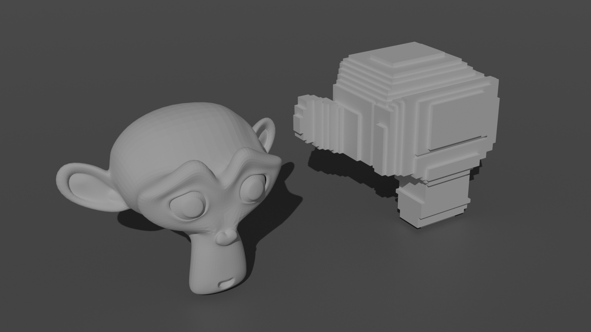
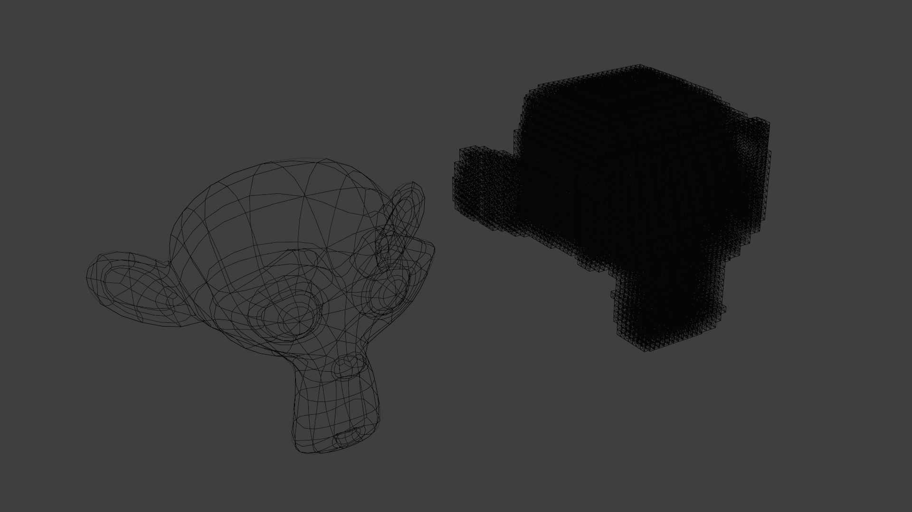
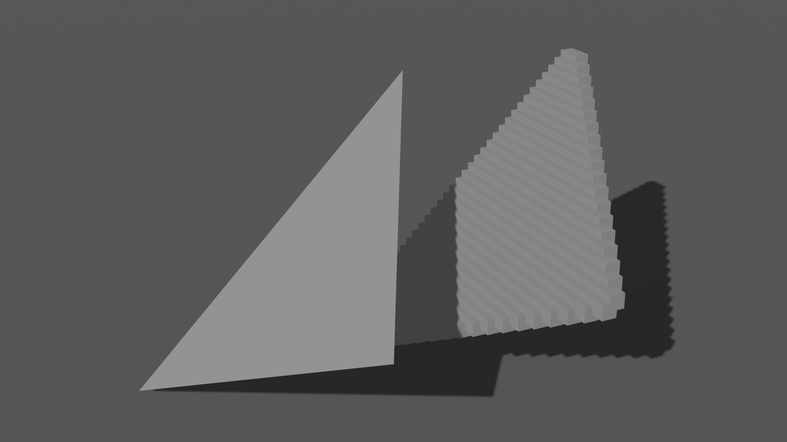
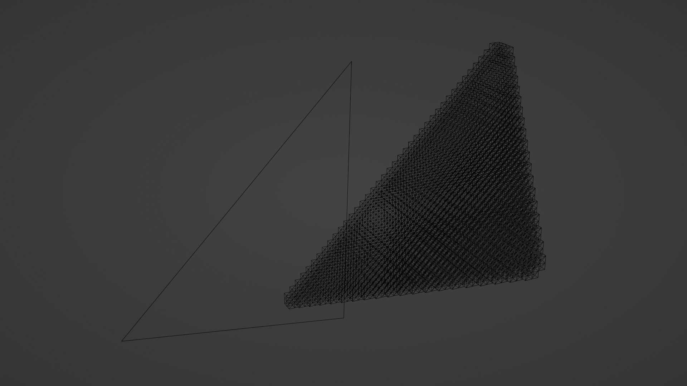

> # Voxelizer
> 用C语言编写的Voxelizer，没有任何依赖项。
> 提供了快速的网格体积计算和点云生成以及体素化。
> # 我为什么要编写这个模块
> 我遇到了一个需要粗略计算模型体积的需求，但是在GitHub上没有一个轻量无依赖的纯C代码实现的Voxelizer，仅有的一个还有一些bug。
> 另外，我希望该实现能够轻松集成到Python进行使用。 
> # 注意
> 该模块只支持三角面，不支持多边形。
> # 编译
>> ## Windows
>>> Mingw环境下，直接使用make命令即可生成一个dll和一个用于测试的exe。dll可以在python中进行使用，使用步骤见example.py。
>>> 如果使用Visual Studio，直接将voxelizer.c和voxelizer.h加入工程编译即可，怎么使用看你自己。
>> ## Unix-Like
>>> 你可能需要先将Makefile中的voxelizer.dll字样改成voxelizer.so，然后使用make命令。
>>> 至于要不要给voxelizer.exe改成voxelizer，看你心情。
> # 参考
> [STL模型像素化](https://zhuanlan.zhihu.com/p/410306876)

---

> # Voxelizer
> Voxelizer writen in C without any dependencies.
> Fast mesh volume accumulation, point cloud generation and voxelization functionalities are provided. 
> # Why I wrote this module
> I've faced the need for calculate mesh volume in approximation, but no lightweight **voxelizer** which includes no dependency and was coded in pure C was found on GitHub, the only one I've found has some bugs. 
> In addition, I hope the implementation can be embeded into python easyly.
> # Attention
> This module only support triangle faces, polygons are not supported.
> # Compile
>> ## Windows
>>> In Mingw environments, use make command to generate a dll and a exe file used for test. Dll can be used in python, follow example.py.
>>> If your working environment is Visual Studio, add voxelizer.c and voxlizer.h into your project and compile, as for how to use, it's up to you.
>> ## Unix-Like
>>> You might need to substitute voxelizer.dll pattern with voxelizer.so, then use make command.
>>> As for substituting voxelizer.exe with voxelizer, it's up to you.
> # Reference
> [STL Mesh Voxelize](https://zhuanlan.zhihu.com/p/410306876)

---

